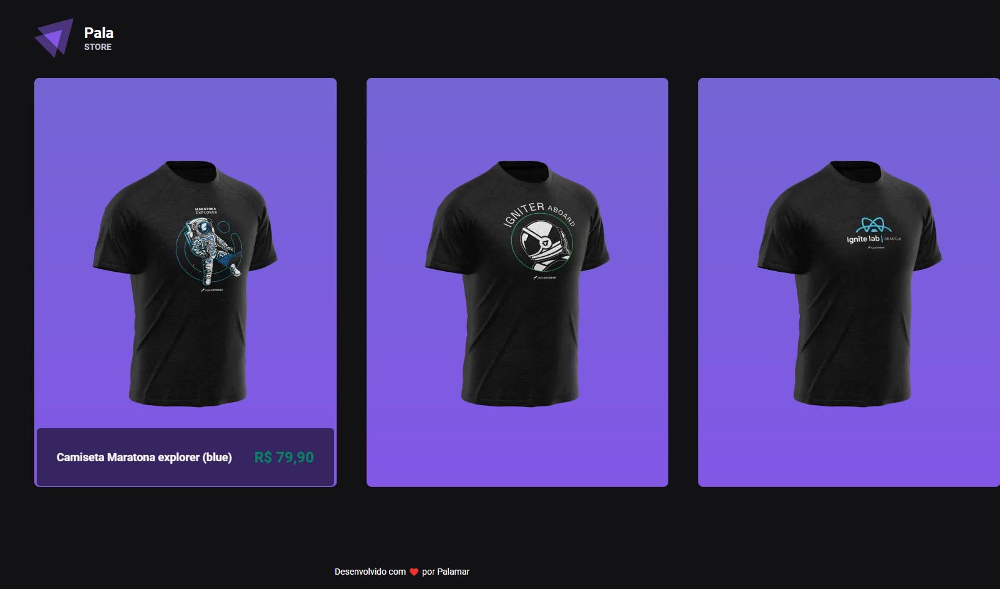
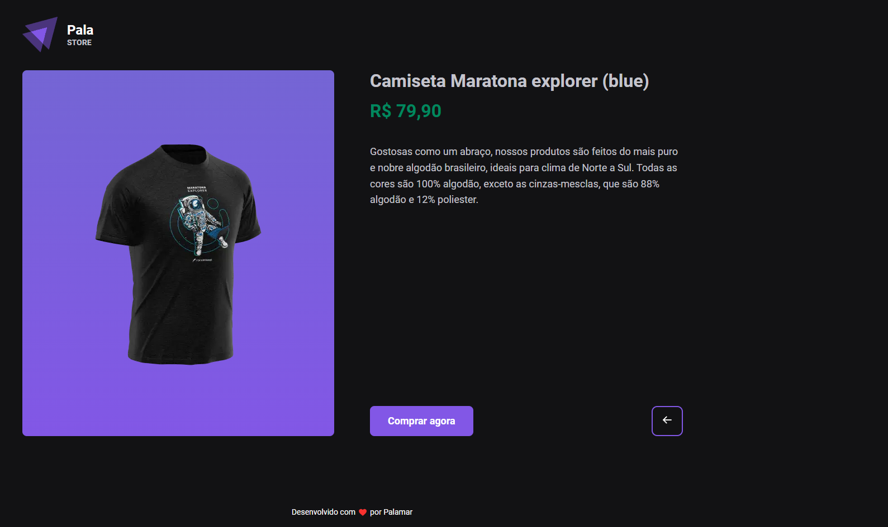

<div align="center">
    
             
</div>
    
<p align="center">   
    
</p>
<p align="center">
  <a href="#sobre">Sobre</a>&nbsp;&nbsp;&nbsp;|&nbsp;&nbsp;&nbsp;
  <a href="#tecnologias">Tecnologias</a>&nbsp;&nbsp;&nbsp;|&nbsp;&nbsp;&nbsp;
  <a href="#como-executar">Como Executar</a>&nbsp;&nbsp;&nbsp;|&nbsp;&nbsp;&nbsp; 
</p>

## Sobre

O projeto é uma plataforma de um pequeno e-commerce utilizando a API do stripe como meio de pagamento.

**Colabore com o projeto, comente, sugestões, reporte bugs, ajude a melhorar o projeto.❤️**

## Tecnologias

- [Typescript](https://www.typescriptlang.org/)
- [Next.js](https://nextjs.org/)
- [Stripe](https://stripe.com/br)
- [stitches](https://stitches.dev/)
- [Axios](https://github.com/axios/axios)

## Como Executar

- ### **Pré-requisitos**

  - É **necessário** possuir o **[Node.js](https://nodejs.org/en/)** instalado no computador
  - É **necessário** possuir o **[Git](https://git-scm.com/)** instalado e configurado no computador
  - Também, é **preciso** ter um gerenciador de pacotes seja o **[NPM](https://www.npmjs.com/)** ou **[Yarn](https://yarnpkg.com/)**.   

1. Faça um clone do repositório:

```sh
  $ git remote add origin git@github.com:aleksanderpalamar/Pala-Store.git
```

2. Executando a Aplicação:

```sh
  # Aplicação web
  $ cd Pala-Store
  # Instalando as dependências do projeto.
  $ yarn # ou npm install
  # Inicie a aplicação web
  $ yarn start # ou npm start
```

---
<sup>Projeto desenvolvido por [Aleksander Palamar](https://github.com/aleksanderpalamar), da [Portfólio](https://www.palamarsolutionit.com.br/).</sup>
